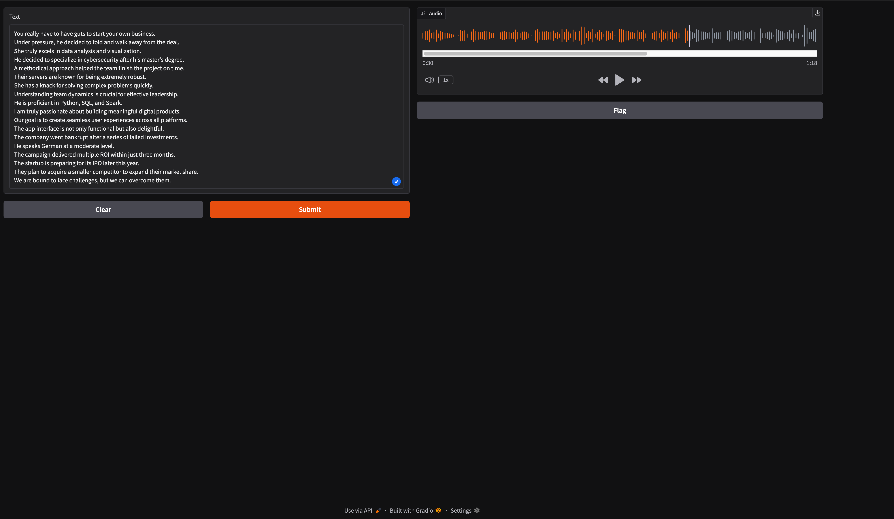

# Text-to-speech

# Посилання на відео:

https://www.youtube.com/watch?v=EyzRixV8s54

https://github.com/coqui-ai/TTS?tab=readme-ov-file

#  створити віртуальне середовище
source - там де знаходиться папка
source .venv/bin/activate

# Створюємо папку outputs
якщо потрібно деактивувати віртуальне середовище:
deactivate

# Наступні команди:

pip install torch
pip install gradio
pip install TTS

pip list | grep TTS

 

tts --list_models

Запускаємо python main.py
та переходимо на посилання в терміналі:

* Running on local URL:  http://00000000000

<!-- 1.Щоб перевірити, в якій ти зараз знаходишся папці (тобто "де я є у файловій системі"), просто введи в терміналі: -->
pwd

<!-- Це скорочення від print working directory, і воно покаже повний шлях до поточної папки. -->

<!-- 2. Додатково: показати список файлів у цій папці -->
ls або ls -la 
<!-- Це допомагає перевірити, чи є там, наприклад, віртуальне середовище або main.py. -->

<!-- 3. Якщо хочеш перейти до іншої папки, використай: -->

cd /шлях/до/папки

<!-- Наприклад: -->

cd ~/Documents/GitHub/Text-to-speech